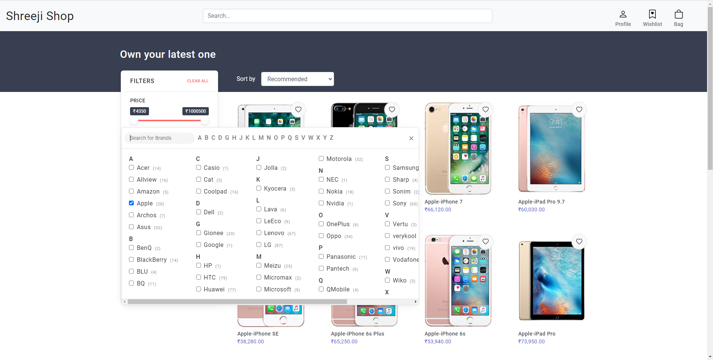

# shreeji-shop

An e-commerce web-application.

Technologies used:
- *Front-end*: Angular 10, Bootstrap 4
- *Back-end*: Spring boot with Oracle 11g database

Screenshots:

- Main page

- Pagination

- Filters

- Phone details

- Sign in

- User actions

- Orders

- Wishlist

- Profile info

- Add to cart

- Cart

- Order Checkout

- Order details

